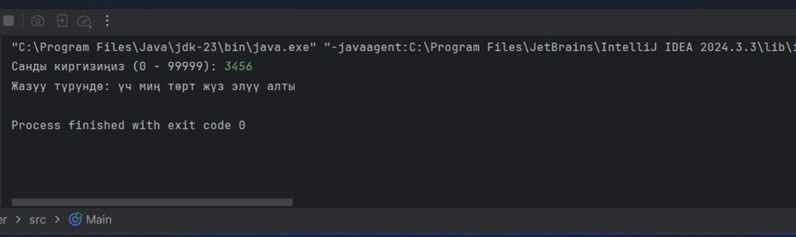
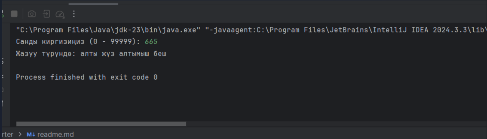
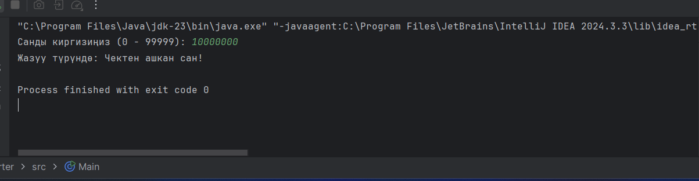
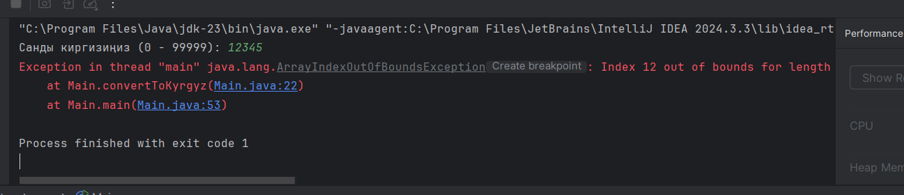
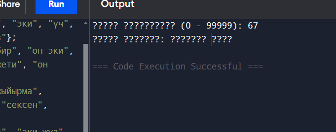

# Project Documentation: Number to Text Converter

1. Project Overview
   The Number to Text Converter is a Java-based program that converts numeric values (ranging from 0 to 99,999) into their corresponding written forms in the Kyrgyz language. The project aims to provide an accurate and grammatically correct representation of numbers, taking into account the linguistic nuances of Kyrgyz numeral structures.

2. Design Choices

The program utilizes arrays to store Kyrgyz translations for numbers (0-9), teens (10-19), tens (20-90), and hundreds (100-900).

A modular approach is taken, breaking down numbers into thousands, hundreds, tens, and ones to ensure accurate conversion.

String concatenation is used to build the final output string in a readable format.

The solution accounts for edge cases such as numbers that start with "one" (e.g., "1000" should be "миң" rather than "бир миң").

3. Algorithms and Data Structures Used

Arrays: Used for storing Kyrgyz numeral words.

Mathematical operations: Integer division (/) and modulus (%) are used to extract thousands, hundreds, tens, and ones from the input number.

Conditional logic: If-else statements ensure proper grammatical structure.

StringBuilder: Used for efficient string concatenation and final output formatting.

4. Challenges Encountered

Handling numbers with thousands correctly, ensuring "one thousand" is represented as "миң" instead of "бир миң."

Managing numbers between 10 and 99 correctly using the Kyrgyz numbering system, which has unique forms for teens (11-19).

Preventing out-of-bounds errors when working with arrays.

Ensuring the program is efficient and avoids redundant calculations.

5. Improvements Made

Implemented additional logic to handle two-digit thousand values properly (e.g., "12,000" correctly converts to "он эки миң").

Optimized string handling using StringBuilder to improve performance.

Enhanced error handling to prevent invalid input values.

Improved modularization of the code, making it easier to maintain and extend.

6. File Handling (Input/Output)
   Currently, the program does not use external files for input or output. Instead, it reads user input from the console and prints the converted text directly to the console. Future improvements could involve reading numbers from a file and outputting results to a text file.

7. Additional Explanations and Future Enhancements

The program could be extended to support numbers beyond 99,999.

Support for different languages could be added using a dictionary-based approach.

The implementation could be optimized further using recursion or lookup tables for efficiency.

A graphical user interface (GUI) or web-based interface could be developed to enhance usability.

This documentation provides a structured understanding of the project, detailing its design, challenges, and improvements while ensuring clarity and ease of comprehension for the reader.

## Example outputs of my code:
1.
2.
3.

### My problems and how i can decide it:
My first problem:

My problem was that i did not add a condition, if the number is a thousandth of a two-digit number , then you programme need to add "мин" to it.
And i decide this problem with adding a condition in my code.

My second problem:
In the beginning when i did not dowloand a intellig idea and i wrote my code in just simple java complier.My rpoblem was that when i run my code, in output shows "?" instead of kyrgyz words. I searched in internet - how can i decide this problem and i found out that i do not applied UTF-8 encoding in my code. Then, I download inetellig IDEA and applied UTF-8, and then i decide my problem.